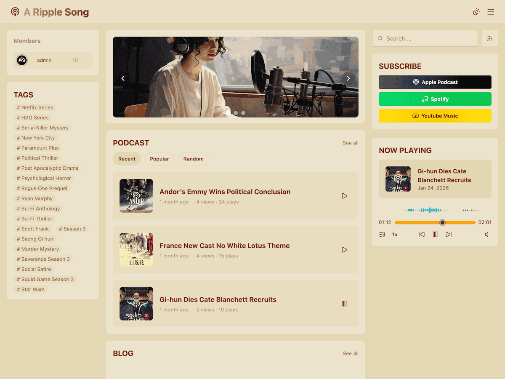

# A Ripple Song

A Ripple Song 是一款經典 WordPress 佈景主題，內建音訊播放器、播客頁面與小工具，搭配[播客外掛](https://github.com/jiejia/a-ripple-song-podcast)可實現播客的發佈與管理，並產生播客 RSS 同步到各大播客平台。

## 特性

- 56 套精美主題配色（26 套亮色主題和 26 套暗色主題）
- 沉浸式音訊播放器
- 國際化支援
- 數據追蹤
- 基於 Swup 的無刷新頁面切換技術
- 多個符合主題風格的小工具

## 連結

- [官網](https://doc-podcast.aripplesong.me/)

## 語言

- [English](../README.md)
- [简体中文](README.zh_CN.md)
- [繁體中文](README.zh-Hant.md)
- [日本語](README.ja.md)
- [한국어](README.ko_KR.md)
- [Français](README.fr_FR.md)
- [Español](README.es_ES.md)
- [Português (Brasil)](README.pt_BR.md)
- [Русский](README.ru_RU.md)
- [हिन्दी](README.hi_IN.md)
- [বাংলা](README.bn_BD.md)
- &lrm;[العربية](README.ar.md)
- &lrm;[اردو](README.ur.md)

## 版權

遵循開源協議 [GPL-3.0](https://github.com/jiejia/a-ripple-song/blob/main/LICENSE)。
